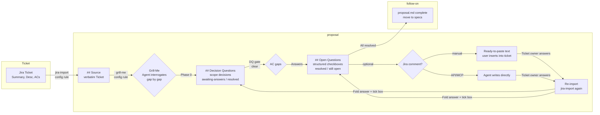

# Jira-Driven OpenSpec Schema

`jira-driven` is a proposal-to-tasks workflow for changes whose requirements
originate from a Jira ticket (Summary, Description, Acceptance Criteria).
It is a **project-provided** schema — a local variant of the `intent-driven`
schema, kept as a separate copy under `openspec/schemas/jira-driven/` to
preserve upstream compatibility. It is not a built-in CLI schema; the CLI
learns about it from the project's `openspec/schemas/` directory (see
[Activate](#activate)).

It authors behaviour with the OpenSpec heading structure in
`specs/<capability>/spec.md` delta files (and
`openspec/specs/<capability>/spec.md` source-of-truth specs). The Markdown is
the document; requirements and scenarios are authored as `### Requirement:` /
`#### Scenario:` headings with `- **WHEN**`/`- **THEN**` steps, extracted to
`Feature:` / `Rule:` / `Scenario:` and executed by the `behave` runner.

- Good fit: changes tracked as Jira tickets where Acceptance Criteria should
  map traceably onto executable scenarios.
- Requires a Gherkin-capable acceptance stack in `openspec/config.yaml`
  (`javascript` or `python`); `python`/`behave` is the expected default for
  this schema.

## Activate

Set this in `openspec/config.yaml`:

```yaml
schema: jira-driven
stack: python
```

**How the CLI resolves this schema.** `jira-driven` is a **project** schema: it
is loaded from `openspec/schemas/jira-driven/schema.yaml`, so it only exists in
a project that carries that directory. It is not a built-in CLI schema. Running
`openspec new change` in a context without that directory reports
`Unknown schema 'jira-driven'. Available: spec-driven`. Inside a project that
ships it, `openspec new change <name>` (without `--schema`) prints
`Creating ... with schema 'spec-driven'` but **writes `.openspec.yaml` with
`schema: jira-driven`** — the created change is correct; the progress line
reflects the CLI's built-in default, not the project schema. Use
`openspec new change <name> --schema jira-driven` to show the accurate schema
in the progress line.

## Proposal Workflow

The Jira ticket is the source of truth for requirements. Unlike standard
OpenSpec schemas where a proposal is free text, the `jira-driven` schema's
proposal phase follows a structured loop that loads the ticket, interrogates
it for gaps, and optionally feeds the outcome back to the ticket.



The loop supports four key operations:

- **jira-import** — fetches the ticket verbatim into `## Source` at proposal
  creation. Fetch is the default: the access probe checks an `opencode.json`
  MCP server whose name matches `/jira/i` (e.g. `"jira"` with the
  `mcp-atlassian` package) first, then Jira env vars
  (`JIRA_URL` + `JIRA_API_TOKEN`, or `JIRA_USERNAME` + `JIRA_API_TOKEN`)
  for a direct HTTP fetch. Only when no access is configured is the user
  asked to paste Summary, Description, and Acceptance Criteria verbatim. Also
  used later for a re-import after the ticket owner replies.
- **Grill-Me** — mandatory by config rule, run in two gated phases. Phase 0
  detects **Decision Questions** (fundamental/scope decisions that gate AC
  interpretation) and records them as `[DQx]` checkboxes in a
  `## Decision Questions` section before `## Open Questions`; a DQ stays a DQ,
  never becomes an AC. The **DQ gate**: FQ generation starts only after no DQs
  are open. Phase 1 then interrogates each vague or missing Acceptance
  Criterion as a `[FQx]` feedback question, records the user's decision as a
  resolved checkbox, and documents any remaining gap as an open checkbox.
- **back-to-Jira comment** — optional, offered after Grill-Me. The agent
  phrases the still-open DQ/FQ questions as a ready-made ticket comment
  (manual default; API/MCP direct write only when the environment has Jira
  access and the user requests it). DQ comments target the ticket author
  (PO/ReqEng). The change then enters the `awaiting-answers` blocked state
  and stops until the user gives the resume signal.
- **re-import** — on the resume signal ("ticket answers arrived"), loads the
  updated ticket verbatim, folds the answers into the relevant section
  (`## Decision Questions` for DQs, `## Open Questions` for FQs), ticks the
  resolved boxes, and applies the AC freeze rules.

A DQ resolves to `resolved` on a PO answer in the ticket OR a team decision
documented as a `Decision:` note (the team decides when the PO is
unreachable so the workflow never blocks). `resolved` is a one-way latch — a
later re-import never flips it back; a re-import with an unchanged ticket
leaves an `awaiting-answers` DQ open.

Acceptance Criteria are located in the Description by anchor — `ACs`, `AC`,
`Acceptance Criteria`, or `Akzeptanzkriterien` (case-insensitive, first match
wins) — and the split is shown to the user for confirmation. If no anchor is
found, the user is asked where the criteria live; the agent never guesses.

### Blocked State And Resume

While DQ or FQ questions are pending, the change is in the `awaiting-answers`
state (the shared status marker sits in `## Decision Questions` and covers the
`## Open Questions` backlog too):

```text
proposal (Grill-Me + optional Jira comment)
   └─► open questions remain?
          ├─ no  ──► proposal complete, proceed to specs
          └─ yes ──► **Status:** awaiting-answers (TICKET-ID · N/M answered ·
                     since DATE · comment sent)
                     workflow STOPS, no busy-waiting
                     user: "answers arrived"  ──► re-import ──► fold in + tick
                     still open? ──► stay blocked; all ticked? ──► proceed
```

The status marker and the open/communicated checkbox backlog make the wait
measurable and visible across sessions. The `specs` step is gated: it refuses
to start while the marker is present and reports the open questions instead.

## Stage Gates

Artifact order:

```text
proposal -> specs -> design -> adr -> tasks
```

Gate expectations:

- `proposal` fetches or pastes the Jira ticket verbatim into the `## Source`
  section (via the `jira-import` skill, fetch-first with a paste fallback),
  runs Grill-Me in two gated phases — Phase 0 records fundamental/scope
  decisions as `[DQx]` checkboxes in `## Decision Questions` (before FQ
  generation), Phase 1 interrogates vague or missing Acceptance Criteria and
  records every resolved or still-open gap as a structured `[FQx]` checkbox in
  `## Open Questions` (with the Grill-Me recommendation and the reason it was
  a gap), and optionally offers to communicate the still-open DQ/FQ questions
  to Jira as a ticket comment. On remaining open questions the change enters
  the `awaiting-answers` blocked state and stops; on the user's resume signal
  a re-import (`jira-import` again) folds the replies into the relevant
  section (`## Decision Questions` / `## Open Questions`) and ticks the
  resolved boxes.
- `specs` creates one OpenSpec Markdown delta file per capability at
  `specs/<capability>/spec.md`, with each Jira Acceptance Criterion traced to
  a scenario via an `<!-- AC: TICKET-ID#N -->` comment. Creating the first
  delta spec is the **AC numbering freeze point**: afterwards only append
  (`AC-N+1`) or supersede (annotated DELETED, never referenced) are allowed —
  never renumbering.
- `design` explains the implementation approach and accounts for currently
  in-force ADRs.
- `adr` writes the per-change ADR review manifest at
  `openspec/changes/<change>/adr.md` after design and before task planning.
- `tasks` are planned only after proposal, specs, design, and ADR artifacts are
  complete.

## Spec Format

Behaviour is authored with the OpenSpec heading structure:
`### Requirement:` (with a SHALL/MUST body line), `#### Scenario:` with
`- **WHEN**`/`- **THEN**` steps, grouped under `## ADDED|MODIFIED|REMOVED|
RENAMED Requirements` delta sections:

```md
## ADDED Requirements

### Requirement: Users can export their own data
The system SHALL let users export their own data.

<!-- AC: PROJ-123#1 -->

#### Scenario: Successful CSV export
- **WHEN** the user exports their data as CSV
- **THEN** the system provides a CSV file containing the user's data
```

A `### Requirement:` names one requirement; one or more consecutive
`#### Scenario:` blocks under it form the examples for that requirement,
mirroring the `intent-driven` schema's grouping. Shipped Gherkin files also
carry a `Feature:` header at the top for extraction; the heading structure
does the grouping.

The Jira AC anchor `<!-- AC: PROJ-123#1 -->` sits **inside** the requirement
block — after the `### Requirement:` description body and before the mapped
`#### Scenario:` heading. Placement before the heading is an error: the native
archive merge drops prose outside the requirement block, so anchors there would
be silently lost at archive time; `run_acceptance.py --check-ac` enforces this.

Do not create `.story` files for this schema; the `acceptance-test-authoring`
skill's `python` stack pack synthesizes the scenarios from the heading
structure into `acceptance-tests/.extracted/**/spec.feature` for `behave`.

## AC Freeze

AC numbering is not authoritative until the change's specs are created.
Before that, open questions are marked with provisional `[ACx]` handles:

- `[AC3]` — a question for this AC is still open; it gets its final number
  at unfreeze (when every question is answered).
- `[AC5] DELETED` — the ticket struck this AC; it stays visible in `## Source`
  for audit but is never referenced by scenarios.

The bracketed handles replace the earlier `AC3-TBD` / `AC5-DELETED` notation:
the brackets keep Jira from auto-linking the strings as issue keys, and the
two formats map one-to-one (provisional `[AC3]` ↔ `AC3-TBD`, `[AC5] DELETED` ↔
`AC5-DELETED`). The `<!-- AC: TICKET-ID#N -->` anchors in specs are unaffected
and remain repo-local.

At unfreeze a single authoritative numbering is fixed. From then on only two
mutations are allowed: **append** (a new AC gets `AC-N+1`, existing anchors
unchanged) and **supersede** (annotate DELETED, unreferenced). Renumbering
existing ACs after the freeze is never allowed — the `<!-- AC: TICKET-ID#N -->`
anchors in specs are the contract, and the coverage gate enforces it.

## Traceability Is One-Way

`<!-- AC: TICKET-ID#N -->` is a repo→ticket marker: it tells a reader which
scenario implements a Jira AC. It is deliberately not a bidirectional sync,
because Jira ACs are free-text description lines without a stable identity —
no link graph can be built. The cost of one-way traceability is that ticket
AC edits are not auto-detected; the re-import mitigates this with drift
warnings (more/fewer/shifted ACs vs `## Source` are reported, never silently
accepted).

## Status-Line Decision (ADR-0001)

The `awaiting-answers` block status is a plain Markdown convention in
`proposal.md` (a status line plus the checkbox backlog), not a
machine-readable YAML/frontmatter field. Rationale: today's only consumer is
the workflow agent, and OpenSpec itself does not interpret the line. See
`adr/0001-block-status-markdown-convention.md`; revisit when a second consumer
outside the agent needs the status programmatically (the automation thread).

## ADR Persistence

Same as `intent-driven`: the `adr` artifact completion signal is the
change-local review manifest at `openspec/changes/<change>/adr.md`. Durable
ADR files live under the target repository's top-level `adr/` folder and are
immutable once accepted; a later decision supersedes rather than edits.

## Validation

Deltas use the OpenSpec heading format (`## ADDED Requirements` /
`### Requirement:` / `#### Scenario:`), so the OpenSpec CLI is the native
validation and merge gate; `openspec archive` merges heading deltas into the
source-of-truth specs directly (the agent-driven sync workflow is retired).
The schema's own schema file passes the CLI's schema syntax check:

```bash
openspec schema validate jira-driven
```

The validation gate for a change is the OpenSpec CLI plus the acceptance
harness. From the repository root, for a change `<change>`:

```bash
openspec validate <change> --type change --strict
run_acceptance.py --lint
run_acceptance.py --check-ac
```

`openspec validate --strict` natively enforces delta sections and that every
requirement has at least one scenario. `run_acceptance.py --lint` runs
gherkin-lint over the extracted scenarios. `run_acceptance.py --check-ac`
enforces the Jira-only checks: every `<!-- AC: TICKET-ID#N -->` comment in the
change's specs maps to a scenario, every AC listed in the proposal's `## Source`
maps to a comment (the **AC coverage gate**, with no orphan comments), and AC
comments are placed inside requirement blocks (placement before a
`### Requirement:` heading is an error, because the native archive merge drops
prose outside the block).

`gherkin-lint` has no built-in defaults, so the harness provisions its
`.gherkin-lintrc` into the repository root at invocation time, in this order:
an existing root `.gherkin-lintrc`, the `acceptance-tests/.gherkin-lintrc`
copy scaffolded by the `acceptance-test-authoring` skill, then the skill's
`references/gherkin-lintrc.json`. The rc is never kept in the schema directory
itself — it only appears when a jira-driven validation runs or the
acceptance-test-authoring skill has been used.

Upstream general-purpose schema this was forked from:
https://github.com/intent-driven-dev/openspec-schemas (see `intent-driven`).